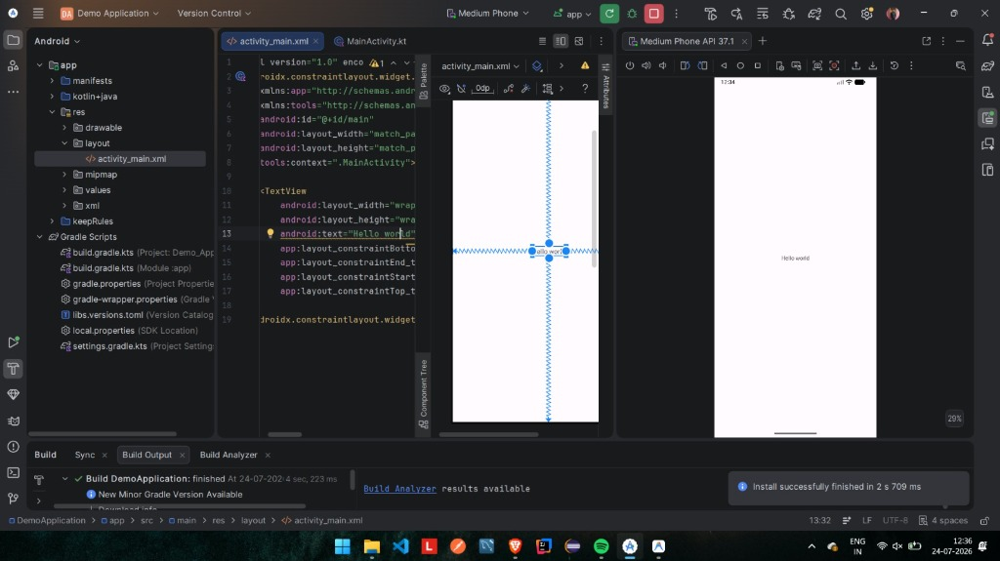
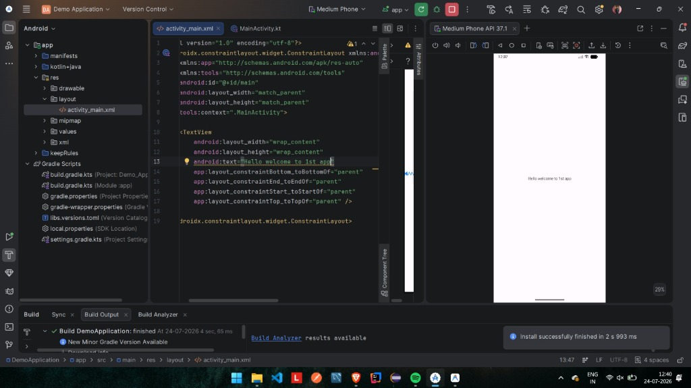
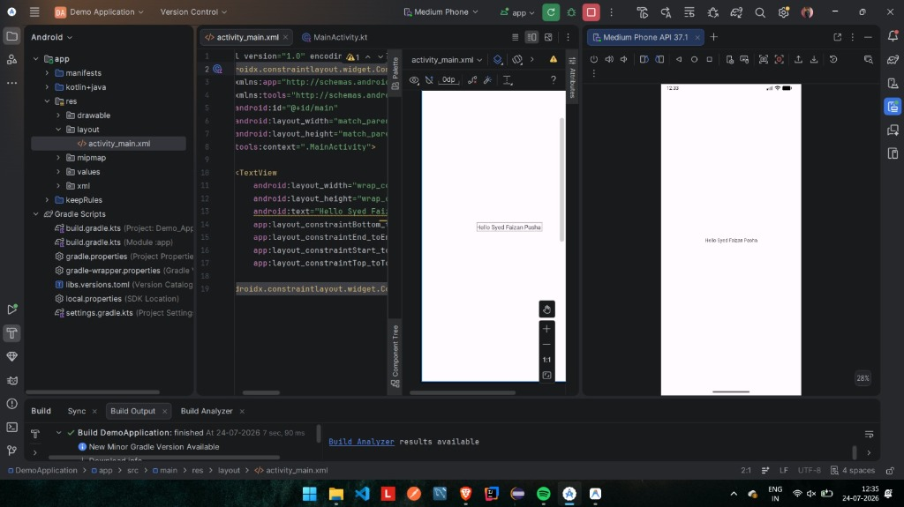

# Experiment 1  =  installation of Android studio and first run progrm

# DemoApplication

A basic Android application developed using Android Studio, Kotlin, and XML layouts. This repository serves as a demonstration of the initial setup, basic UI modifications, and emulator execution.

## Features
- **Centralized TextView Layout**: Displays a customizable greeting centered on the screen using `ConstraintLayout`.
- **Dynamic Text Updates**: Demonstrates editing layout XML (`activity_main.xml`) to display custom messages.
- **Emulator Execution**: Verified successfully on a `Medium Phone API 37.1` emulator.

## Screenshots

Here is the progress of updating and running the application on the emulator:

### 1. Default Hello World
Initially, the application displayed the default greeting:


---

### 2. Welcome to 1st App
Updated the TextView layout to welcome the user to their first app:


---

### 3. Personalized Greeting
Updated the TextView layout to display a custom personalized greeting:


## Project Structure
- `app/src/main/res/layout/activity_main.xml` - UI layout file containing the TextView element.
- `app/src/main/java/com/example/demoapplication/MainActivity.kt` - Main activity class handling app initialization.

## How to Run

1. **Clone the Repository**:
   ```bash
   git clone https://github.com/syedfa612/Android-Studio.git
   ```
2. **Open in Android Studio**:
   - Launch Android Studio.
   - Select **Open** and choose the `DemoApplication` directory.
3. **Build the Project**:
   - Let Gradle sync and build the project.
4. **Run the App**:
   - Start an emulator (e.g., Medium Phone API 37.1) or connect a physical Android device.
   - Click the **Run** button (green play icon) in the toolbar.
