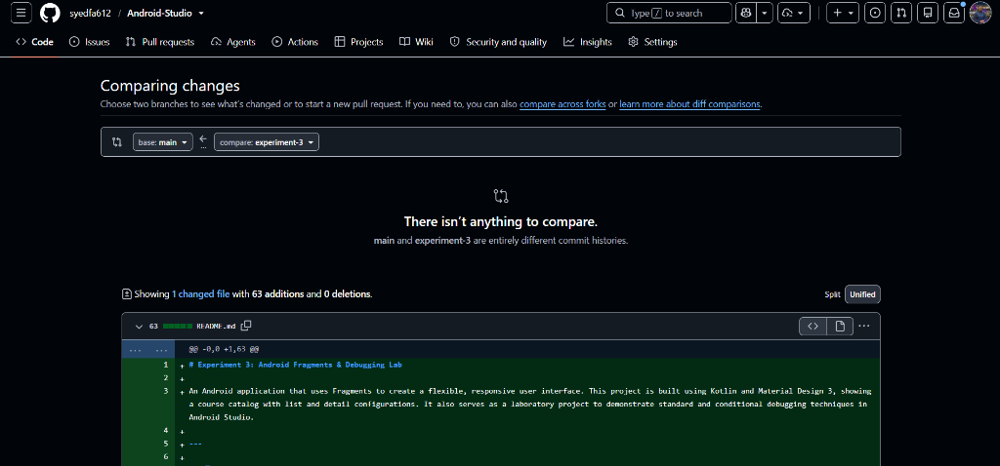
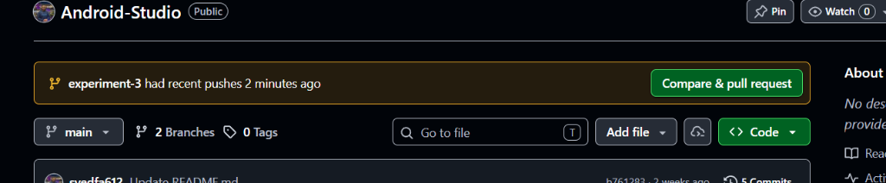

# Experiment 3: Android Fragments & Debugging Lab

An Android application that uses Fragments to create a flexible, responsive user interface. This project is built using Kotlin and Material Design 3, showing a course catalog with list and detail configurations. It also serves as a laboratory project to demonstrate standard and conditional debugging techniques in Android Studio.

---

## 📱 Application Overview
The application showcases a **Master-Detail flow** designed to dynamically adapt to different screen dimensions:
1. **ListFragment:** Displays a scrollable list of courses (e.g. *Android Development*, *Kotlin Programming*, *Full-Stack Web Dev*, *Data Science*) in cards styled with custom tags, difficulty badges, and duration.
2. **DetailFragment:** Shows the expanded details, description, overview, and registration button for the selected course.

### Responsive Design Adaptability
* **Portrait Mode (Phones):** Uses a single-pane navigation flow. Tapping an item in the list fragment replaces it with the detail fragment (added to the back stack) so that users can navigate back easily.
* **Landscape Mode (Tablets/Rotated Phones):** Uses a split dual-pane layout. The list is displayed on the left (weight `1.2`) and the detail screen on the right (weight `1.8`), allowing updates to occur instantly using a shared `ViewModel` state.

### 📸 Screenshots
| Course List | Course Detail |
| :---: | :---: |
|  |  |

---

## 🛠️ Architecture & Setup
* **Language:** Kotlin
* **Minimum SDK:** 24
* **Compile SDK:** 37 (API 37)
* **Libraries Used:**
  * `androidx.fragment:fragment-ktx` for simplified shared view model instantiation (`by activityViewModels()`).
  * `com.google.android.material:material` for Material Design 3 components.
  * `androidx.recyclerview:recyclerview` for course list rendering.

---

## 🔍 Debugging Experiment Exercises

This lab includes two primary debugging exercises. Here is how to run and test them in Android Studio:

### Exercise 1: Fragment Lifecycle & Local Variables Inspection
1. Open the project in Android Studio and run the app in **Debug Mode** (`Shift + F9` or click the green Bug icon).
2. Open [`DetailFragment.kt`](app/src/main/java/com/example/a3rdexperiment/DetailFragment.kt).
3. Place a **normal breakpoint** on the first line inside the observer block:
   ```kotlin
   emptyState.visibility = View.GONE
   ```
4. Click on any course in the emulator list.
5. The execution will pause at the breakpoint. Inspect the following:
   * **Variables Panel:** Verify the values inside the local variables: `course` (contains the data fields), `this` (referencing the current Fragment), and `view`.
   * **Call Stack (Frames Panel):** Check how the call stack routed from click listeners up through the lifecycle/LiveData dispatch pipeline.
   * **Logcat Panel:** Look for the lifecycle logs prefixed with `DetailFragment` to verify the creation callbacks: `onCreate` -> `onCreateView` -> `onViewCreated` -> `onStart` -> `onResume`.

### Exercise 2: Conditional Breakpoints
1. Open [`ListFragment.kt`](app/src/main/java/com/example/a3rdexperiment/ListFragment.kt).
2. Place a breakpoint on the line inside the selection listener:
   ```kotlin
   viewModel.selectCourse(course)
   ```
3. Right-click the red breakpoint dot in the gutter and enter this expression in the **Condition** field:
   ```kotlin
   course.title.equals("Android Development")
   ```
4. Press **Done** and run in Debug Mode (`Shift + F9`).
5. **Observation:**
   * Clicking *Kotlin Programming* or *Data Science* updates the details panel but **does not pause** execution.
   * Clicking *Android Development* will **halt execution**, allowing you to inspect the program state only for this specific condition.

### Difference Between Breakpoint Types
* **Normal Breakpoint:** Suspends thread execution every single time the marked line is run, regardless of variables or state. Useful for checking simple flow.
* **Conditional Breakpoint:** Suspends execution only if a specific condition (boolean expression) evaluates to `true`. Crucial for checking bugs inside loops, high-frequency events, or targeted data values without clicking "Resume" multiple times.
