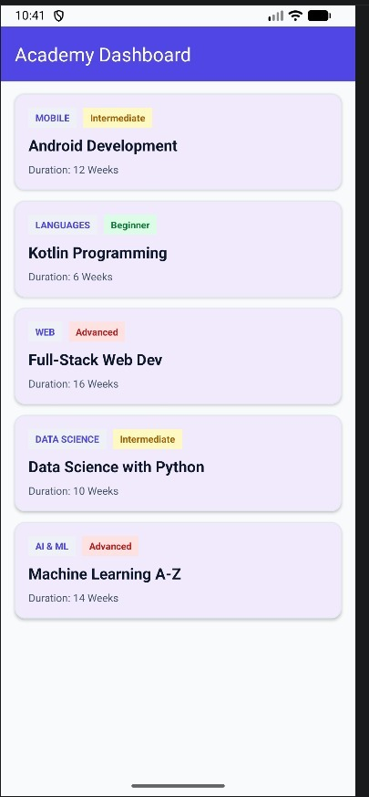
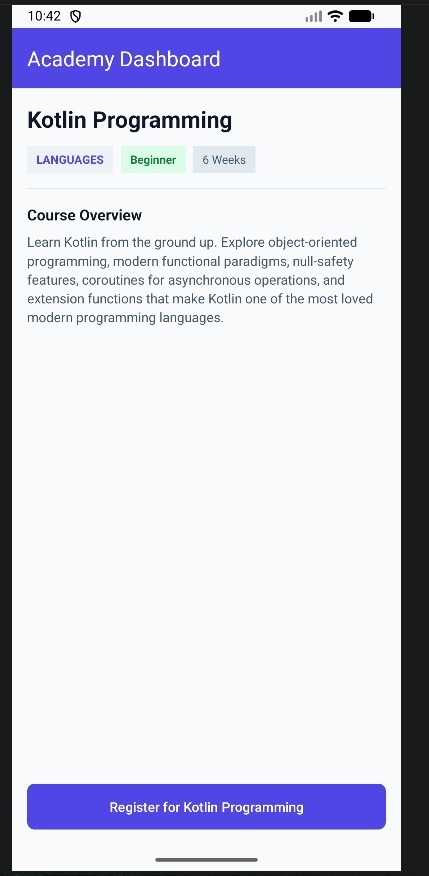
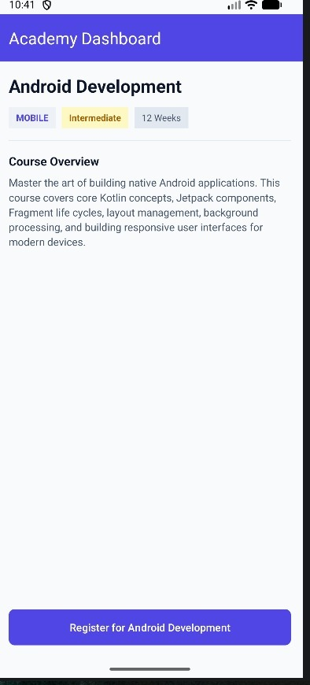
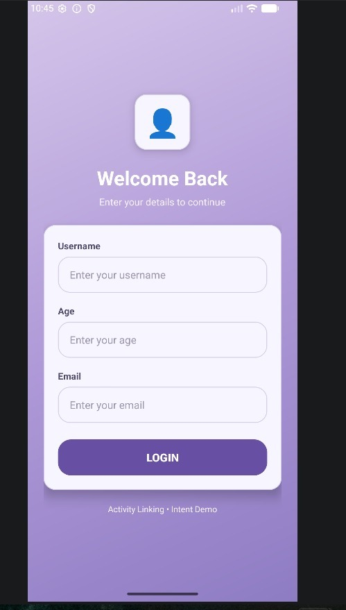
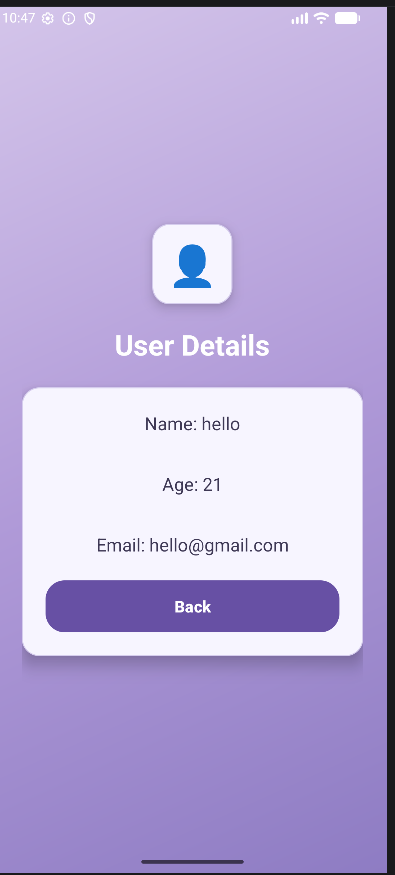
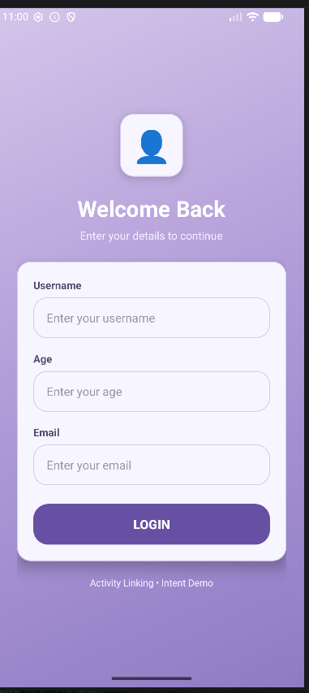
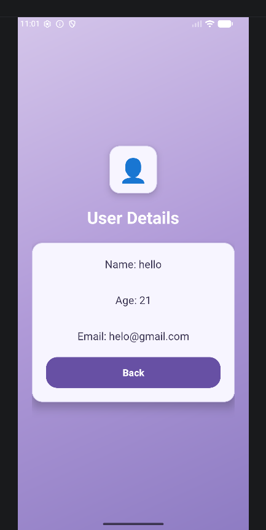

# Android Studio Experiments

This repository contains my Android Studio laboratory experiments for Android application development.

---

## 📁 Repository Structure

### 1. [Experiment 1: Demo Application](Experiment_1/)
* **Description:** A basic introductory Android application (e.g., hello world, setting up the development environment, verifying builds, and taking initial screenshots).
* **Location:** `/Experiment_1`

### 2. [Experiment 3: Adaptive Fragments UI](Experiment_3/)
* **Description:** A responsive course dashboard application using Fragments. It adapts dynamically to screen sizes:
  * **Single-Pane layout** for phone-sized portrait displays.
  * **Dual-Pane split layout** for tablet or landscape orientations.
* **Lab Exercises:** Demonstrates normal breakpoints (inspecting fragment lifecycle, call stacks, and local variables) and conditional breakpoints.
* **Location:** `/Experiment_3`
* **Screenshots:**
  
  | Course List | Kotlin Detail | Android Detail |
  | :---: | :---: | :---: |
  |  |  |  |

### 3. [Experiment 4: Linking Activities Using Intents](Experiment_4/)
* **Description:** An Android application demonstrating activity navigation and passing data using Explicit Intents and Extras (Username, Age, Email form flow).
* **Location:** `/Experiment_4`
* **Screenshots:**

  | Welcome Back / Login | User Details / Second Activity |
  | :---: | :---: |
  |  |  |

### 4. [Experiment 5: Android Notifications](Experiment_5/)
* **Description:** An Android application demonstrating the creation and display of notifications upon successful login/validation, building upon the Activity Linking and Intent flow.
* **Location:** `/Experiment_5`
* **Screenshots:**

  | Welcome Back / Login | User Details |
  | :---: | :---: |
  |  |  |

---

## 🛠️ How to Open and Run
1. Clone this repository to your local machine:
   ```bash
   git clone https://github.com/syedfa612/Android-Studio.git
   ```
2. Open **Android Studio**.
3. Select **File > Open** and choose the directory of the specific experiment you want to work on:
   * Select `/Experiment_1` to open the first app.
   * Select `/Experiment_3` to open the fragments app.
   * Select `/Experiment_4` to open the intents app.
   * Select `/Experiment_5` to open the notification app.
4. Click **Run** (`Shift + F10`) or **Debug** (`Shift + F9`).
